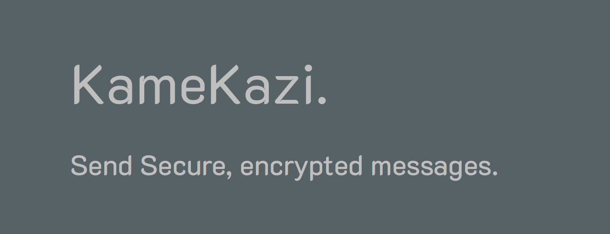

[](https://goreportcard.com/report/github.com/gaurav-gogia/KameKazi) [](https://github.com/gaurav-gogia/KameKazi/issues)

[](.github/banner.png)

KameKazi 🔐
===


*KameKazi* is a project that allows you to send secure messages.
Each message receives a completely unique ID and is encrypted, so absolutely nobody can see the message without the key, not even with access to the database. 
All messages are destroyed as soon as the receiver opens them.
The project has been written in Golang.


# How does it work?

Here's an [awesome presentation](./Presentation.pptx) by [Neeraj Srivastava](https://github.com/nsrivastava645)

# Contributing 

## How to Make a Pull Request (PR)

### Instructions

- Click on Fork Repository using the 'Fork' button on the top
- Clone the forked repository on your PC. Using this command on your Git bash or any terminal with git support : ``` git clone url ```
- Now create a new branch and switch to it with this command: ``` git checkout -b new-user-yourname ```
- Go ahead and make changes
- You can add your details in contributers.md file
- See if you can solve an issue and send PR
- Star the repository
- New issues are also welcome
- After making changes use this command to add the changes: ``` git add filename ```, and then ``` git commit -m "Added" ```
- After that use this command: ``` git push origin new-user-yourname ```
- Create a Pull Request (PR) from your github forked repository page, and wait for Pull Request to get merged

### Disclaimer
Yes, documentation is bad. PR's that improve the documentation are welcome! =)
